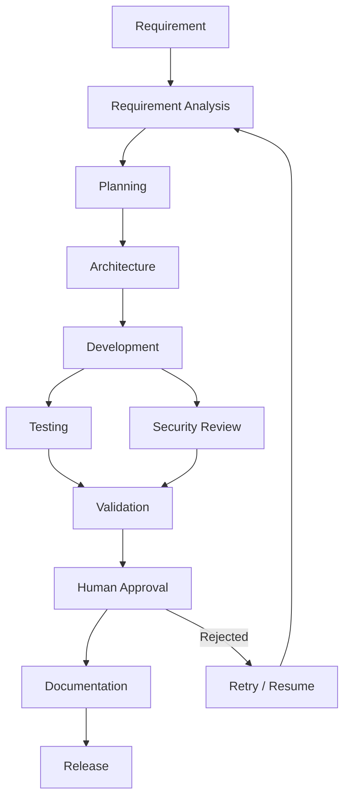

# Software Engineering Orchestrator

This project is a Spring Boot application I built to simulate a software engineering workflow using multiple specialized agents.

A requirement moves through stages such as requirement analysis, planning, architecture, development, testing, security review, validation, documentation, and release approval.

Testing and security checks run in parallel, while the remaining stages follow workflow dependencies.

## What it does

- Processes software requirements through multiple engineering agents
- Uses a workflow graph to manage dependencies
- Runs testing and security checks in parallel
- Handles failures and execution timeouts
- Stores workflow state and audit history in H2
- Supports retrying failed or rejected workflows
- Supports resuming a workflow from its last completed stage
- Includes human approval and rejection before release
- Includes a URL shortener with expiration and click tracking
- Includes integration tests for the main workflow scenarios
- Uses GitHub Actions to run Maven tests automatically

## Tech Stack

Java 21, Spring Boot, Spring Data JPA, Hibernate, H2, Maven, CompletableFuture, ExecutorService, JUnit 5, and GitHub Actions.

## Run the application

```powershell
.\mvnw.cmd spring-boot:run
```

## Run tests

```powershell
.\mvnw.cmd test
```

## Build

```powershell
.\mvnw.cmd clean package
```

## Main APIs

```text
POST /api/v1/workflows
GET  /api/v1/workflows/{executionId}
GET  /api/v1/workflows/{executionId}/history

POST /api/v1/workflows/{executionId}/approve
POST /api/v1/workflows/{executionId}/reject
POST /api/v1/workflows/{executionId}/retry
POST /api/v1/workflows/{executionId}/resume
```

The goal of this project is to demonstrate workflow orchestration, parallel processing, persistence, failure recovery, and human-in-the-loop approval using Java and Spring Boot.

## Workflow


